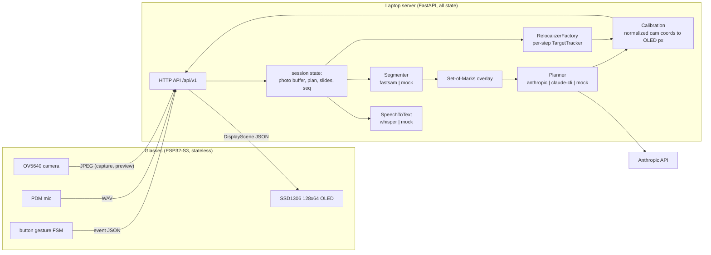

# Architecture

lstk-eye is a two-part system: HUD glasses that are deliberately dumb, and a laptop
server that does all the thinking. The glasses capture JPEG photos and WAV audio, POST
them over WiFi, and draw whatever JSON scene comes back on a 128x64 OLED. The server
owns every byte of state: photo buffers, sessions, the plan, the current slide, the
relocalization trackers.

## Component diagram

Every stage in the server column is an abstract interface
(`src/lstk_eye/pipeline/interfaces.py`) with at least two implementations - a real one
and a mock - constructed from config by `src/lstk_eye/pipeline/factories.py`.

## Request dataflow

One ask, end to end:

1. **Capture** - single click on the device POSTs a JPEG to `/api/v1/photos`; the
   server buffers it and acks with a counter scene. Multiple captures may be buffered
   for one request.
2. **Ask** - long press records the mic; on release the WAV goes to `/api/v1/ask`.
   The server transcribes it (`SpeechToText.transcribe` -> `Transcript`).
3. **Segment** - the newest capture frame goes through `Segmenter.segment` ->
   `list[SegMask]`: every object region with a `mark_id` (numbered from 1), a
   normalized bbox, centroid, and area, already filtered by `segmenter.min_area` /
   `segmenter.max_masks`.
4. **Set-of-Marks** - the server draws the numbered marks onto the photo and encodes
   it as PNG. This marked image is the only geometry the LLM ever sees.
5. **Plan** - `Planner.plan(marked_png, question, marks)` -> `Plan`, a list of
   `PlanStep`s. Each step carries a short HUD label and either a `mark_id` chosen from
   the provided list or `None` for text-only steps ("wait 30 seconds"). Out-of-range
   marks raise `PlanningError`; they never reach the display.
6. **Resolve** - mark numbers resolve to mask centroids (normalized camera
   coordinates), producing precomputed `Slide`s for the whole plan.
7. **Compose** - `Calibration` maps the current slide's anchor to OLED pixels.
   In-window anchors become an arrow plus label; out-of-window anchors become an edge
   chevron (`Calibration.edge_for` picks the edge). The scene `seq` is bumped and the
   `AskResponse` returns the first slide with `active: true`.

## Relocalization loop

While a session is active the device streams small preview frames (QVGA, 2-3 fps) to
`/api/v1/preview`. For the active step the server holds a `TargetTracker` (built by
`RelocalizerFactory.create` from the capture frame and the step's bbox) and calls
`update` on every preview frame:

- **Found** - the anchor moves to the matched position (EMA-smoothed per
  `reloc.ema`), the scene is recomposed, and the response carries the new scene.
- **Not found** - arrows hide; only a status line remains. Trackers own their
  hysteresis: appear fast (`reloc.appear_conf`), disappear lazily
  (`reloc.disappear_conf`, `reloc.miss_hide` consecutive misses). Anchoring is to the
  object in the frame, so a moved object and a turned head are the same case.
- **Double click** - `/api/v1/event {"type": "next"}` advances to the next
  precomputed slide and starts a fresh tracker for its target.
- **Session end** - any response with `active: false` tells the device to stop
  streaming previews.

Planned, not yet wired: an MPU6050 gyro on the device shifting the overlay at 100 Hz
between server anchor updates. Nothing in the current software path uses IMU data.

## Key design decisions

**Thin-client device, all state on the server.** The ESP32 does camera-in, pixels-out
and nothing else. Every brain upgrade - better segmenter, different LLM, new
relocalizer - ships without touching firmware. It also keeps the firmware small enough
to parse every message with a static ArduinoJson buffer.

**Set-of-Marks numbers instead of coordinates.** The planner may reference objects
only by the mark numbers drawn on the photo, never by raw coordinates. VLMs
hallucinate coordinates; they are much better at reading a printed number. Validation
becomes trivial (`mark_id in marks`), and the server resolves numbers to centroids it
computed itself.

**Normalized [0, 1] coordinates through the whole pipeline.** Capture frames
(e.g. 1024x768) and preview frames (e.g. 320x240) have different resolutions;
normalized floats make every stage resolution-independent. Conversion to display
pixels happens exactly once, in the calibration/composition step - a resolution change
anywhere never ripples.

**HTTP request/response only, always device-initiated.** No WebSocket, no server
push at v1. While a session is active the device is already streaming previews at
2-3 fps, and each preview response piggybacks the latest scene - so anchor update
latency is bounded by the preview rate and a push channel would buy nothing. The
firmware needs only an HTTP client. The schemas are transport-agnostic; WebSocket can
be layered on later without changing them.

**Every stage pluggable, mock profile first-class.** Each stage is an ABC with a real
and a mock implementation, selected via config (`--profile mock` swaps all of them at
once). Heavy dependencies (faster-whisper, ultralytics) are imported only inside the
module that wraps them, so the mock profile, the test suite, and CI run with zero ML
dependencies and no API key.

## Latency budget

| Path | Budget | Why |
|---|---|---|
| Plan generation (STT + segmentation + LLM) | 3-6 s, once per ask | model inference; paid once, steps are precomputed |
| Slide advance (double click) | instant | one HTTP round trip; no inference |
| Anchor refresh | 1-2 Hz | bounded by the 2-3 fps preview stream |
| Text rendering on the device | instant | scenes are tiny; full OLED redraw is ~25 ms over I2C |

The trade is explicit: this is an AI laser pointer plus a teleprompter, not
world-locked realtime AR. Text never degrades; arrows follow at 1-2 Hz.
